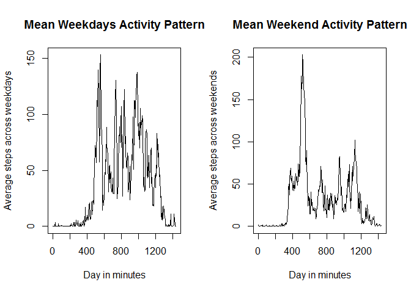

# Reproducible Research: Peer Assessment 1
# Project 1
# By MAVC 18/04/2015

## Loading and preprocessing the data.
The data was loaded froma local file provided for this assignment. Dates were transform from character variables to a date variable. Intervals of activity were changed to represent the 5 minutes interval of a 24 hours day. 


```r
library(ggplot2)
setwd("~/My Documents/2015 Coursera/Data Science - Johns Hopkins Uni/05 Reproducible Research/Project 1/RepData_PeerAssessment1")
activity <- read.csv("activity.csv")
activity$date <- as.Date(activity$date)
activity$interval <- (activity$interval%/%100)*60 + activity$interval%%100
```

## What is mean total number of steps taken per day?
The number of steps pere day were calculated for each day and presented in the histogram below. Similarly the mean and median of each day was calculated an stored in a new variable summary_analysis. Only the first rows of the summary are showed.

```r
total_steps_per_day <-sapply(split(activity$steps, f=activity$date, drop = FALSE), sum, na.rm = TRUE)
hist(total_steps_per_day, breaks = 20, main = "Total number of steps per Day", xlab = "Number of Steps")
```

 

```r
mean_steps_per_day <-sapply(split(activity$steps, f=activity$date, drop = FALSE), mean, na.rm = TRUE)
median_steps_per_day <-sapply(split(activity$steps, f=activity$date, drop = FALSE), median, na.rm = TRUE)
summary_analysis <- data.frame(mean_steps_per_day,median_steps_per_day)
head(summary_analysis)
```

```
##            mean_steps_per_day median_steps_per_day
## 2012-10-01                NaN                   NA
## 2012-10-02            0.43750                    0
## 2012-10-03           39.41667                    0
## 2012-10-04           42.06944                    0
## 2012-10-05           46.15972                    0
## 2012-10-06           53.54167                    0
```

## What is the average daily activity pattern?


```r
mean_daily_activity_pattern <-sapply(split(activity$steps, f=activity$interval, drop = FALSE), mean, na.rm = TRUE)
plot(names(mean_daily_activity_pattern), mean_daily_activity_pattern, type = "l", main = "Mean Daily Activity Pattern", xlab = "Day in minutes", ylab = "Average steps across all days")
```

 

```r
maximun_activity_interval <- which.max(mean_daily_activity_pattern)
maximun_activity_interval
```

```
## 515 
## 104
```

## Imputing missing values

```r
number_NA <- sum(is.na(activity))
number_NA
```

```
## [1] 2304
```
The number of missing values was calculated to be 2304. Those missing values were replace, by using the most common number of steps taken during a 5 minutes interval. Assuming the most likely value for the missing data is at large the most frequent number of steps taken across the 2 months of study.

A summary of the results for the tidy data is showed bellow.

```r
#New Data Frame
original_activity <- activity
#Method to replace NAs values by the most common number of steps recorded
most_common_number_steps <- which.max(table(activity$steps))
activity[is.na(activity)] <- as.numeric(names(most_common_number_steps))
total_steps_per_day_noNA <-sapply(split(activity$steps, f=activity$date, drop = FALSE), sum, na.rm = TRUE)
hist(total_steps_per_day_noNA, breaks = 20, main = "Total number of steps per Day", xlab = "Number of Steps")
```

 

```r
mean_steps_per_day_noNA <-sapply(split(activity$steps, f=activity$date, drop = FALSE), mean, na.rm = TRUE)
median_steps_per_day_noNA <-sapply(split(activity$steps, f=activity$date, drop = FALSE), median, na.rm = TRUE)
summary_analysis <- data.frame(mean_steps_per_day_noNA, median_steps_per_day_noNA)
head(summary_analysis)
```

```
##            mean_steps_per_day_noNA median_steps_per_day_noNA
## 2012-10-01                 0.00000                         0
## 2012-10-02                 0.43750                         0
## 2012-10-03                39.41667                         0
## 2012-10-04                42.06944                         0
## 2012-10-05                46.15972                         0
## 2012-10-06                53.54167                         0
```

## Are there differences in activity patterns between weekdays and weekends?
By separating the weekdays from weekends we can see a strong difference in the pattern, as showed by the graphic bellow. The numbers of steps taken is bigger on weekday showing a increase activity across the day except for the time were the subjects were more likely to be asleep.

```r
activity$day <- weekdays(activity$date)
activity[activity$day == "Monday",4] <- "weekday"
activity[activity$day == "Tuesday",4] <- "weekday"
activity[activity$day == "Wednesday",4] <- "weekday"
activity[activity$day == "Thursday",4] <- "weekday"
activity[activity$day == "Friday",4] <- "weekday"
activity[activity$day == "Saturday",4] <- "weekend"
activity[activity$day == "Sunday",4] <- "weekend"
activity$day <- as.factor(activity$day)
weekends <- activity[which(activity$day == 'weekday'),]
weekdays <- activity[which(activity$day == 'weekend'),]
mean_weekdays_activity_pattern <-sapply(split(weekdays$steps, f=weekdays$interval, drop = FALSE), mean, na.rm = TRUE)
mean_weekends_activity_pattern <-sapply(split(weekends$steps, f=weekends$interval, drop = FALSE), mean, na.rm = TRUE)
par(mfrow = c(1, 2))
plot(names(mean_weekdays_activity_pattern), mean_weekdays_activity_pattern, type = "l", main = "Mean Weekdays Activity Pattern", xlab = "Day in minutes", ylab = "Average steps across weekdays")
plot(names(mean_weekends_activity_pattern), mean_weekends_activity_pattern, type = "l", main = "Mean Weekend Activity Pattern", xlab = "Day in minutes", ylab = "Average steps across weekends")
```

 
